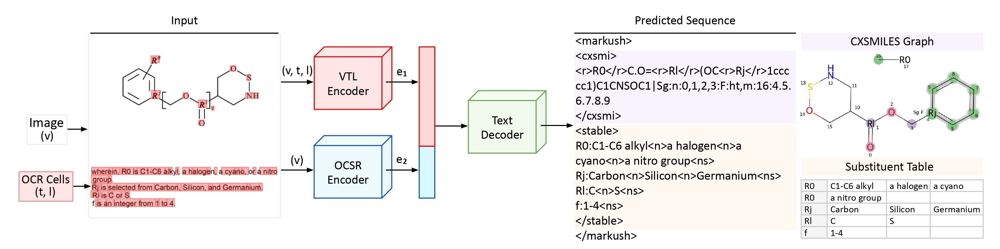

# MarkushGrapher-IBM

[](https://huggingface.co/datasets/ds4sd/MarkushGrapher-Datasets)
[](https://doi.org/10.48550/arXiv.2503.16096)

This is the repository for [MarkushGrapher: Joint Visual and Textual Recognition of Markush Structures](https://arxiv.org/abs/2503.16096).



### Citation 

If you find this repository useful, please consider citing:

```
@article{morin2025markushgrapherjointvisualtextual,
	title        = {{MarkushGrapher: Joint Visual and Textual Recognition of Markush Structures}},
	author       = {Lucas Morin and Valéry Weber and Ahmed Nassar and Gerhard Ingmar Meijer and Luc Van Gool and Yawei Li and Peter Staar},
	year         = 2025,
	journal      = {arXiv preprint arXiv:2503.16096},
	url          = {https://arxiv.org/abs/2503.16096},
	eprint       = {2503.16096},
	archiveprefix = {arXiv},
	primaryclass = {cs.CV}
}
```

### Installation

1. Create a virtual environment.
```
python3 -m venv markushgrapher-env
source markushgrapher-env/bin/activate
```

2. Install MarkushGrapher.
```
pip install -e .
```

3. Install [transformers](https://github.com/lucas-morin/transformers). This fork contains the code for the MarkushGrapher architecture. It was written starting from a copy of the UDOP architecture.
```
git clone https://github.com/lucas-morin/transformers.git ./external/transformers
pip install -e ./external/transformers
```

4. Install [MolScribe](https://github.com/lucas-morin/MolScribe.git). This fork contains minor fixes for compatibility with albumentations.
```
git clone https://github.com/lucas-morin/MolScribe.git ./external/MolScribe
pip install -e ./external/MolScribe --no-deps
```

### Model

Download the MarkushGrapher model from [HuggingFace](https://huggingface.co/ds4sd/MarkushGrapher/).
```
huggingface-cli download ds4sd/MarkushGrapher --local-dir ./tmp/ --repo-type model && cp -r ./tmp/models . && rm -r ./tmp/
```

Download the MolScribe model from [HuggingFace](https://huggingface.co/yujieq/MolScribe/). 
```
wget https://huggingface.co/yujieq/MolScribe/resolve/main/swin_base_char_aux_1m680k.pth -P ./external/MolScribe/ckpts/ 
```

### Datasets 

Download the datasets from [HuggingFace](https://huggingface.co/datasets/ds4sd/MarkushGrapher-Datasets).
```
huggingface-cli download ds4sd/MarkushGrapher-Datasets --local-dir ./data/hf --repo-type dataset
```

For training, we use:
1. MarkushGrapher-Synthetic-Training (Synthetic dataset)

For benchmarking, we use:
1. M2S (Multi-modal real-world dataset)
2. USPTO-Markush (Image-only real-world dataset)
3. MarkushGrapher-Synthetic (Synthetic dataset)

The synthetic datasets are generated using [MarkushGenerator](https://github.com/DS4SD/MarkushGenerator). 

### Inference

Note: MarkushGrapher is currently not able to process images without OCR annotations. The model relies on OCR bounding boxes and text provided as input. 

1. Select a dataset by setting the `dataset_path` parameter in `MarkushGrapher/config/dataset_predict.yaml`.

2. Run MarkushGrapher.
```
python3.10 -m markushgrapher.eval config/predict.yaml
```
3. Read predictions in ``. 

4. Visualize predictions in: ``. 

### Training

1. Select the training configuration in `MarkushGrapher/config/train.yaml` and `MarkushGrapher/config/datasets/datasets.yaml`.

2. Run training script.
```
PYTHONUNBUFFERED=1 CUDA_VISIBLE_DEVICES=0 python3.10 -m markushgrapher.train config/train.yaml
```

### Acknowledgments

MarkushGrapher uses the code of [UDOP](https://arxiv.org/abs/2212.02623) and the [MolScribe](https://arxiv.org/abs/2205.14311) model. 

MarkushGrapher was trained from the pre-trained UDOP weights available on [HuggingFace](https://huggingface.co/ZinengTang/Udop) (checkpoint: `udop-unimodel-large-512-300k-steps.zip`).