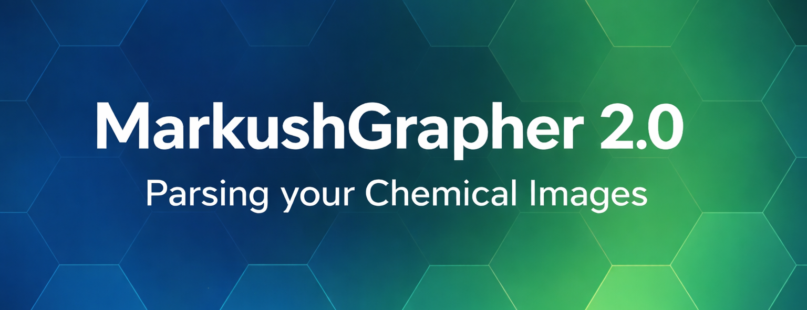
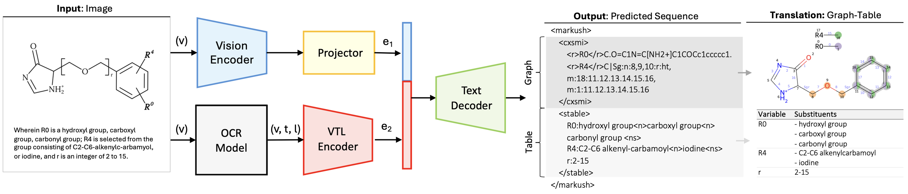

<p align="center">
  
</p>

<p align="center">
  <a href="https://timstrohmeyer.github.io/MarkushGrapher-2-website/"></a>
  <a href="https://huggingface.co/docling-project/MarkushGrapher-2"></a>
  <a href="https://huggingface.co/datasets/docling-project/MarkushGrapher-2-Datasets"></a>
  <a href="https://arxiv.org/abs/2503.16096"></a>
</p>

---

**MarkushGrapher 2.0** is an end-to-end multimodal model for recognizing both molecular structures and Markush structures from chemical document images. It jointly encodes vision, text, and layout modalities to auto-regressively generate CXSMILES representations and substituent tables.

MarkushGrapher 2.0 substantially outperforms state-of-the-art models — including MolParser, MolScribe, GPT-5, and DeepSeek-OCR — on Markush structure recognition benchmarks, while maintaining competitive performance on standard molecular structure recognition (OCSR).

**Resources:** [Model](https://huggingface.co/docling-project/MarkushGrapher-2) | [Datasets](https://huggingface.co/datasets/docling-project/MarkushGrapher-2-Datasets) | [Paper (v2)](https://timstrohmeyer.github.io/MarkushGrapher-2-website/) | [Paper (v1)](https://arxiv.org/abs/2503.16096)

## What's New in 2.0

Compared to [MarkushGrapher 1.0](https://arxiv.org/abs/2503.16096), version 2.0 introduces several major improvements (the v1 code is available under the [`markushgrapher-v1`](../../tree/markushgrapher-v1) tag):

- **End-to-End Processing** — A dedicated **ChemicalOCR** module extracts text and bounding boxes directly from images, eliminating the need for external OCR annotations.
- **Two-Phase Training Strategy** — Phase 1 (Adaptation) aligns the projector and decoder to pretrained OCSR features; Phase 2 (Fusion) introduces the VTL encoder for joint multimodal training, improving encoder fusion.
- **Universal Recognition** — A single model handles both standard molecular images (SMILES) and multimodal Markush structures (CXSMILES + substituent tables).
- **New Training Data Pipeline** — Automatic construction of large-scale real-world Markush training data from USPTO MOL files (2010–2025).
- **New Benchmark: IP5-M** — 1,000 manually annotated Markush structures from patent documents across all five IP5 patent offices (USPTO, JPO, KIPO, CNIPA, EPO).

## Installation

### Quick Setup

Run the setup script to install everything (dependencies, forks, model weights):

```bash
bash setup.sh
source markushgrapher-env/bin/activate
```

### Manual Setup

<details>
<summary>Step-by-step instructions</summary>

1. Create a virtual environment:
```bash
python3.10 -m venv markushgrapher-env
source markushgrapher-env/bin/activate
```

2. Install MarkushGrapher:
```bash
PIP_USE_PEP517=0 pip install -e .
```

3. Install the [transformers fork](https://github.com/lucas-morin/transformers) (contains the MarkushGrapher architecture, built on UDOP):
```bash
git clone https://github.com/lucas-morin/transformers.git ./external/transformers
pip install -e ./external/transformers
```

4. Install the [MolScribe fork](https://github.com/lucas-morin/MolScribe.git) (minor fixes for albumentations compatibility):
```bash
git clone https://github.com/lucas-morin/MolScribe.git ./external/MolScribe
pip install -e ./external/MolScribe --no-deps
```

5. **(Apple Silicon only)** For fast ChemicalOCR inference on Mac, install [mlx-vlm](https://github.com/Blaizzy/mlx-vlm):
```bash
pip install mlx-vlm
```

6. Download model weights:
```bash
huggingface-cli download docling-project/MarkushGrapher-2 --local-dir ./models/markushgrapher-2
huggingface-cli download docling-project/ChemicalOCR --local-dir ./models/chemicalocr
wget https://huggingface.co/yujieq/MolScribe/resolve/main/swin_base_char_aux_1m680k.pth -P ./external/MolScribe/ckpts/
```

</details>

> **Apple Silicon:** On first run, the ChemicalOCR model is automatically converted to MLX format. This is a one-time operation.

## Inference

### End-to-End (Images → CXSMILES)

Place your chemical structure images (`.png`) in a directory and run:

```bash
bash scripts/inference/inference.sh ./data/images
```

This runs the full pipeline:
1. Converts images to HuggingFace dataset format
2. Runs **ChemicalOCR** to extract text labels and bounding boxes
3. Runs **MarkushGrapher 2.0** to predict CXSMILES and substituent tables

Visualizations are saved to `data/visualization/prediction/`.

The ChemicalOCR backend is selected automatically:
| Platform | Backend | Speed |
|---|---|---|
| NVIDIA GPU | vllm | Fastest (batched) |
| Apple Silicon | mlx-vlm | ~1.5s per image |
| CPU | transformers | Slow (fallback) |

> **Note:** ChemicalOCR requires a GPU (NVIDIA CUDA or Apple Silicon) for reliable results. Running on CPU produces mostly incorrect OCR output, which degrades the overall pipeline accuracy.

### Step by Step

**Step 1:** Convert images to HuggingFace dataset and apply ChemicalOCR:
```bash
python3 scripts/dataset/image_dir_to_hf_dataset.py \
  --image_dir ./data/images \
  --output_dir ./data/hf/sample-images \
  --apply_ocr \
  --ocr_model_path ./models/chemicalocr
```

**Step 2:** Run MarkushGrapher inference:
```bash
python3 -m markushgrapher.eval config/predict.yaml
```

The dataset path is configured in `config/datasets/datasets_predict.yaml`.

## Architecture

<p align="center">
  
</p>

MarkushGrapher 2.0 employs two complementary encoding pipelines:

1. **Vision Encoder Pipeline** — The input image is processed by an OCSR vision encoder (Swin-B ViT, from MolScribe) followed by an MLP projector.
2. **Vision-Text-Layout Pipeline** — The image is passed through ChemicalOCR to extract text and bounding boxes, which are then jointly encoded with the image via a VTL encoder (T5-base backbone, UDOP fusion).

The projected vision embedding (e1) is concatenated with the VTL embedding (e2) and fed to a text decoder that auto-regressively generates CXSMILES and substituent tables.

**Model size:** 831M parameters (744M trainable)

## Results

### Markush Structure Recognition (CXSMILES Accuracy)

| Model | M2S | USPTO-M | WildMol-M | IP5-M |
|---|:---:|:---:|:---:|:---:|
| MolParser-Base | 39 | 30 | 38.1 | 47.7 |
| MolScribe | 21 | 7 | 28.1 | 22.3 |
| GPT-5 | 3 | — | — | — |
| DeepSeek-OCR | 0 | 0 | 1.9 | 0.0 |
| MarkushGrapher 1.0 | 38 | 32 | — | — |
| **MarkushGrapher 2.0** | **56** | **55** | **48.0** | **53.7** |

### Molecular Structure Recognition (SMILES Accuracy)

| Model | WildMol | JPO | UOB | USPTO |
|---|:---:|:---:|:---:|:---:|
| MolParser-Base | **76.9** | **78.9** | 91.8 | 93.0 |
| MolScribe | 66.4 | 76.2 | 87.4 | **93.1** |
| MolGrapher | 45.5 | 67.5 | 94.9 | 91.5 |
| **MarkushGrapher 2.0** | 68.4 | 71.0 | **96.6** | 89.8 |

## Datasets

Download the datasets from [HuggingFace](https://huggingface.co/datasets/docling-project/MarkushGrapher-2-Datasets):
```bash
huggingface-cli download docling-project/MarkushGrapher-2-Datasets --local-dir ./data/hf --repo-type dataset
```

### Training Data

| Phase | Dataset | Size | Type |
|---|---|---|---|
| OCR | Synthetic ChemicalOCR | 235k | Synthetic |
| OCR | IP5 ChemicalOCR | 7k | Real (manually annotated) |
| Phase 1 (Adaptation) | MolScribe USPTO | 243k | Real (image-SMILES pairs) |
| Phase 2 (Fusion) | Synthetic CXSMILES | 235k | Synthetic |
| Phase 2 (Fusion) | MolParser | 91k | Real (converted to CXSMILES) |
| Phase 2 (Fusion) | USPTO-MOL-M | 54k | Real (auto-extracted from MOL files) |

### Benchmarks

**Markush Structure Recognition:**
- **M2S** (103) — Real-world multimodal Markush structures with substituent tables
- **USPTO-M** (74) — Real-world Markush structure images
- **WildMol-M** (10k) — Large-scale semi-manually annotated Markush structures
- **IP5-M** (1,000) — *New* — Manually annotated Markush structures from IP5 patent offices (1980–2025)

**Molecular Structure Recognition (OCSR):**
- USPTO (5,719), JPO (450), UOB (5,740), WildMol (10k)

The synthetic datasets are generated using [MarkushGenerator](https://github.com/DS4SD/MarkushGenerator).

## Training

```bash
PYTHONUNBUFFERED=1 CUDA_VISIBLE_DEVICES=0 python3.10 -m markushgrapher.train config/train.yaml
```

Configure training in `config/train.yaml` and `config/datasets/datasets.yaml`.

## Acknowledgments

MarkushGrapher builds on [UDOP](https://arxiv.org/abs/2212.02623) (Vision-Text-Layout encoder) and [MolScribe](https://arxiv.org/abs/2205.14311) (OCSR vision encoder). The ChemicalOCR module is based on [SmolDocling](https://github.com/DS4SD/SmolDocling). Training was initialized from the pretrained UDOP weights available on [HuggingFace](https://huggingface.co/ZinengTang/Udop).

## Citation

If you find this repository useful, please consider citing:

```bibtex
@inproceedings{strohmeyer2026markushgrapher2,
  title     = {MarkushGrapher-2: End-to-end Multimodal Recognition of Chemical Structures},
  author    = {Strohmeyer, Tim and Morin, Lucas and Meijer, Gerhard Ingmar and Weber, Valery and Nassar, Ahmed and Staar, Peter W. J.},
  booktitle = {Proceedings of the IEEE/CVF Conference on Computer Vision and Pattern Recognition (CVPR)},
  year      = {2026}
}

@inproceedings{Morin_2025,
  title     = {MarkushGrapher: Joint Visual and Textual Recognition of Markush Structures},
  url       = {http://dx.doi.org/10.1109/CVPR52734.2025.01352},
  DOI       = {10.1109/cvpr52734.2025.01352},
  booktitle = {2025 IEEE/CVF Conference on Computer Vision and Pattern Recognition (CVPR)},
  publisher = {IEEE},
  author    = {Morin, Lucas and Weber, Val\'{e}ry and Nassar, Ahmed and Meijer, Gerhard Ingmar and Van Gool, Luc and Li, Yawei and Staar, Peter},
  year      = {2025},
  month     = jun,
  pages     = {14505--14515}
}
```
